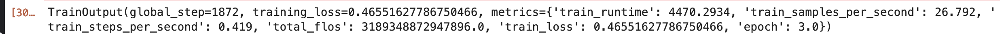
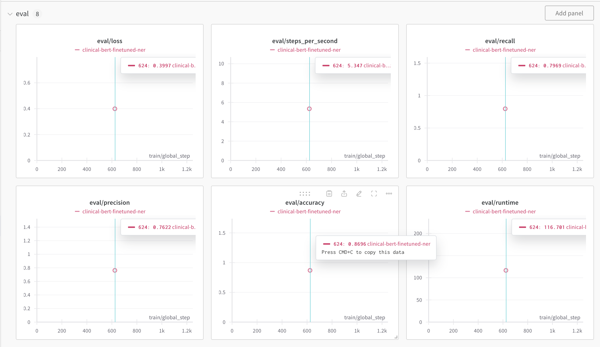
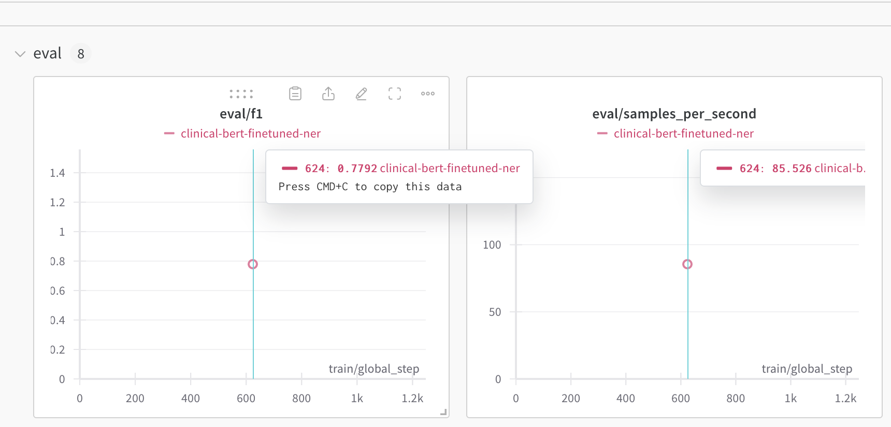
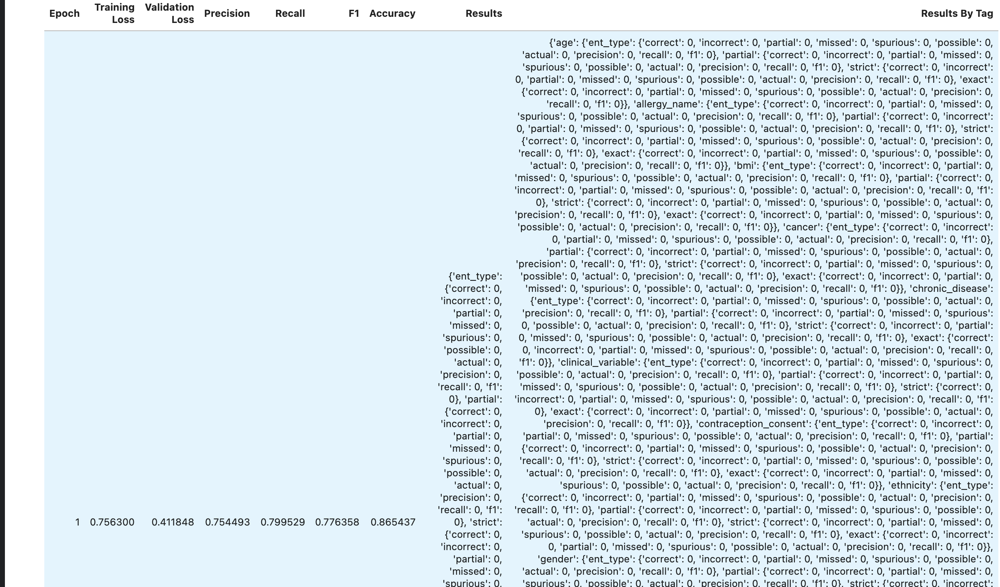
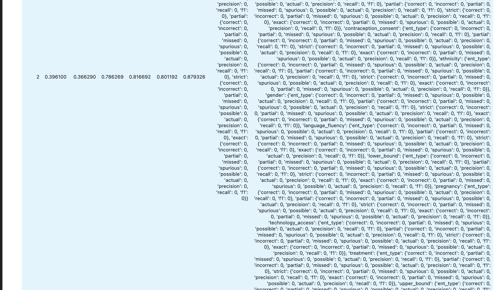
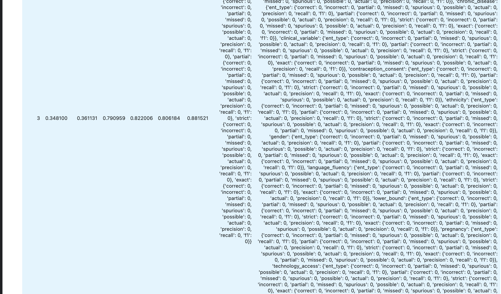
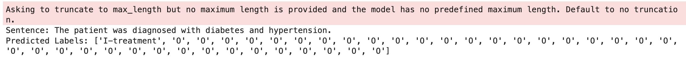
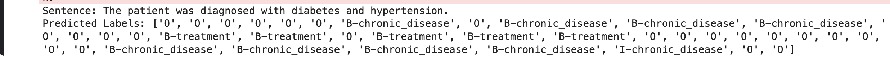
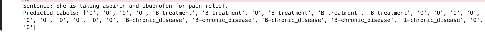
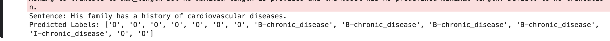

# ClinicalBERT Fine-Tuning Project

## Overview

This project focuses on fine-tuning the ClinicalBERT model using clinical notes data. The goal is to preprocess the data, train the model, and evaluate its performance. The repository is organized into several folders to streamline these tasks.

## Project Structure

```
├── config
│  ├──config.json # Hyperparameters and configuration for training
├── data
│   ├── raw # Raw dataset from the source (clinical notes)
│   ├── processed # Processed dataset ready for training and evaluation
|
├── models
│   ├── clinicalbert_finetuned    
|   ├── model.safetensors # Fine-tuned model saved here
├── notebooks
│   ├── *.ipynb # Jupyter notebooks for ClinicalBERT experiments
├── ├── src
│   ├── preprocess.py # Script for data preprocessing
│   ├── train.py # Script for training the model
│   ├── evaluate.py # Script for evaluating the model
│   ├── generate_csv.py # Script for generating CSV files for training
```


## Folder Details

- **config**: Contains `config.json` which holds hyperparameters and other configuration settings necessary for training the model.

- **data**:
  - **raw**: This folder stores the raw clinical notes data obtained from the source.
  - **processed**: Here, you will find the dataset after it has been processed and prepared for training and evaluation.

- **models**: The fine-tuned ClinicalBERT model will be saved in this folder. The model file is named `model.safetensors`.

- **notebooks**: Includes various Jupyter notebooks used for different experiments and analyses with ClinicalBERT.

- **src**: Contains Python scripts for different stages of the workflow:
  - `preprocess.py`: Script for preprocessing the raw data.
  - `train.py`: Script for training the ClinicalBERT model.
  - `evaluate.py`: Script for evaluating the model's performance.
  - `generate_csv.py`: Script for generating CSV files required for training.

## Getting Started

### Prerequisites

Ensure you have the following installed:
- Python 3.x
- Required Python packages (listed in `requirements.txt`)

### Setup

1. Clone the repository:
    ```sh
    git clone https://github.com/your-username/your-repository.git
    cd your-repository
    ```

2. Install the required packages:
    ```sh
    pip install -r requirements.txt
    ```

3. Update the `config/config.json` file with your specific hyperparameters and configuration settings.

### Data Preparation

1. Place your raw clinical notes data in the `data/raw` folder.

2. Run the preprocessing script:
    ```sh
    python src/preprocess.py
    ```
   This will process the raw data and save it in the `data/processed` folder.

### Training

Run the training script to fine-tune the ClinicalBERT model:
```sh
python src/train.py
```

The fine-tuned model will be saved in the models/clinicalbert_finetuned folder.

### Evaluation
Evaluate the model's performance using the evaluation script:
```sh
python src/evaluate.py
```
### Training Metrics


### Evaluation Metrics






### Predicted Labels from unseen data





### Notebooks
Explore the notebooks folder for various Jupyter notebooks that contain detailed analyses and experiments.

